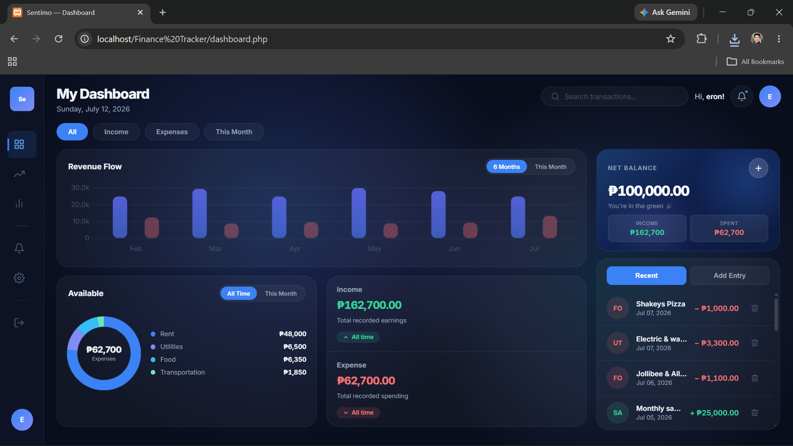
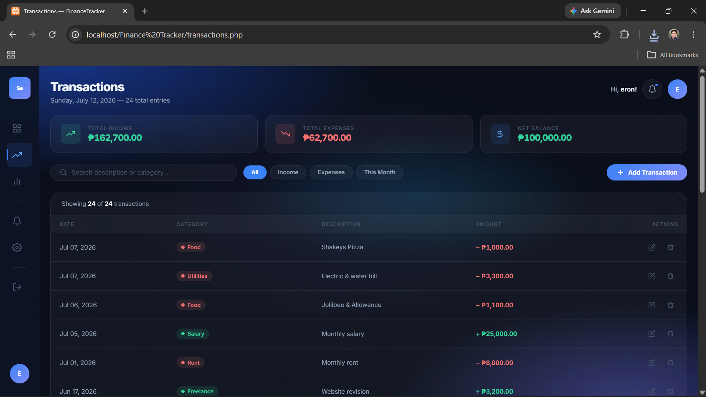
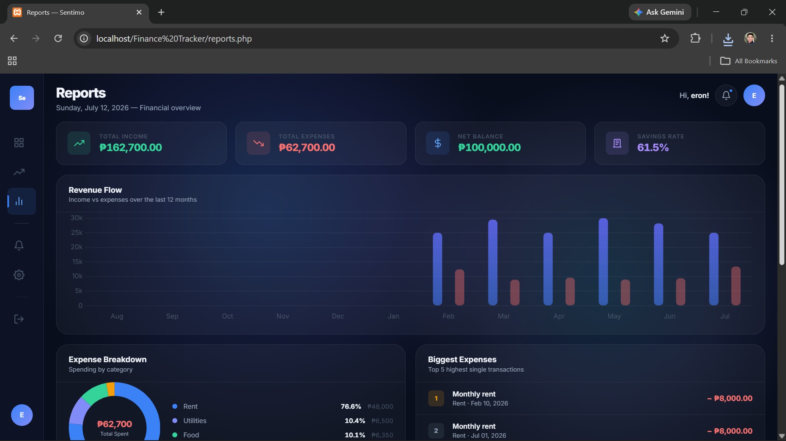
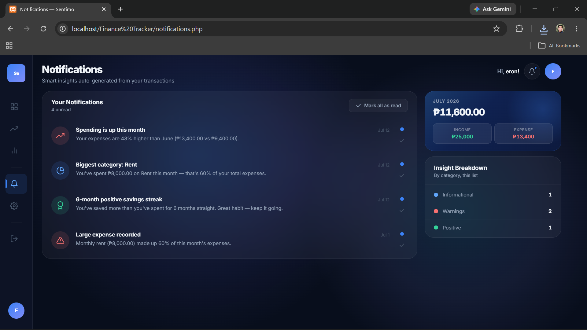
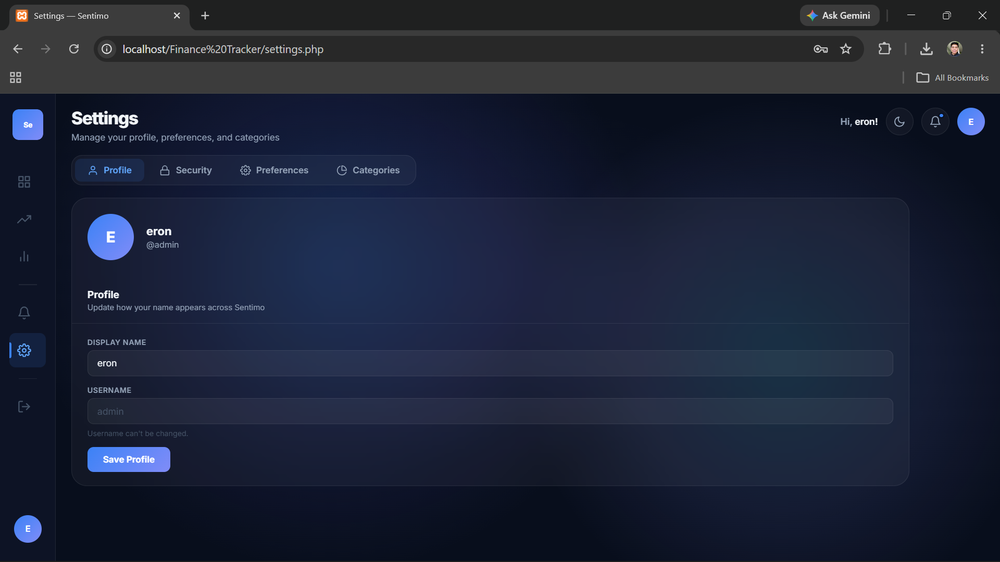
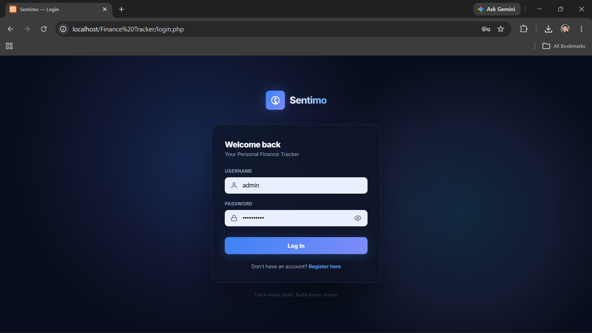

# Sentimo — Personal Finance Tracker

A full-stack personal finance web application built with PHP, MySQL, and vanilla CSS. Sentimo lets users log daily income and expenses, visualize spending patterns, track their net balance, and receive smart financial insights — all without a heavy framework.

> Built as a self-directed upskilling project during OJT to demonstrate full-stack PHP development, UI/UX design, and secure web application fundamentals.

---

## Screenshots

**Dashboard**


**Transactions**


**Reports**


**Notifications**


**Settings**


**Login**


---

## Features

- **Secure Authentication** — Registration with `password_hash()` BCRYPT, session-based login and logout
- **Transaction Management** — Log income and expenses with category, description, and date; edit and delete entries
- **Revenue Flow Chart** — 6-month bar chart (Chart.js) showing income vs. expense trends
- **Expense Breakdown** — Donut chart visualizing spending by category with percentages
- **Financial Reports** — 12-month revenue flow, biggest expenses list, monthly comparison table with savings rate
- **Smart Notifications** — Auto-generated insights based on transaction data (spending trends, savings streaks, budget alerts)
- **Real-time Filtering** — Filter by type and month, live search by description or category — zero page reloads
- **Dark and Light Mode** — Toggle in Settings, persists across all pages and tabs via localStorage
- **Avatar Dropdown** — Quick access to Settings and Logout from any page
- **Expandable Sidebar** — Icon-only at rest, expands with labels on hover
- **PRG Pattern** — Post/Redirect/Get on all form submissions to prevent duplicate entries on refresh

---

## Tech Stack

| Layer | Technology |
|---|---|
| Backend | PHP 8.2 |
| Database | MySQL via PDO with prepared statements |
| Frontend | Vanilla CSS (Flexbox + Grid), Vanilla JS |
| Charts | Chart.js via CDN |
| Typography | Inter via Google Fonts |
| Local Server | XAMPP (Apache + MySQL) |

No npm. No React. No Composer. Every page is a single self-contained PHP file — intentionally lightweight for the XAMPP environment.

---

## Project Structure

```
Finance Tracker/
├── db.php              # PDO database connection
├── login.php           # Session-based authentication
├── register.php        # User registration with BCRYPT hashing
├── logout.php          # Session destruction and redirect
├── dashboard.php       # Main hub — charts, balance card, recent transactions
├── transactions.php    # Full transaction table with add, edit, delete
├── reports.php         # Revenue flow, expense breakdown, monthly summary
├── notifications.php   # Smart insights auto-generated from transaction data
├── settings.php        # Profile, password, theme, and category management
└── schema.sql          # Database schema — import this to get started
```

---

## Setup & Installation

### Prerequisites

- XAMPP or any Apache + MySQL + PHP 8.x stack
- PHP 8.2+
- MySQL 5.7+ or MariaDB

### Steps

**1. Clone the repository**
```bash
git clone https://github.com/eronzxc/Finance-Tracker.git
```

**2. Move to your htdocs folder**
```
C:/xampp/htdocs/Finance Tracker/
```

**3. Create the database**

Open phpMyAdmin, create a new database named `personal_finance`, then import `schema.sql`.

**4. Configure the connection**

Open `db.php` and update credentials if needed:
```php
$host = '127.0.0.1';
$db   = 'personal_finance';
$user = 'root';
$pass = '';
```

**5. Start XAMPP and open in browser**
```
http://localhost/Finance Tracker/login.php
```

---

## Security Highlights

- Passwords hashed with `PASSWORD_BCRYPT` via `password_hash()` and verified with `password_verify()`
- All queries use PDO prepared statements — no raw SQL string interpolation
- Session authentication check on every protected page
- User-scoped queries — users can only access their own transactions
- `htmlspecialchars()` on all rendered user input to prevent XSS
- PRG pattern prevents duplicate form submissions on page refresh

---

## Roadmap

- [ ] Budget limits per category with over-budget alerts
- [ ] Export transactions to CSV
- [ ] Pagination for large transaction histories

---

## Author

**Eron** — Computer Engineering Student, currently on OJT
[github.com/eronzxc](https://github.com/eronzxc)

---

## License

This project is open source and available under the [MIT License](LICENSE).
